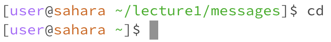

# Lab Report 01

> cd 

**using the command with no arguments**

- **working directory**: the working directory was ~/lecture1/messages
- i got that output because the command cd is the change directory bash command, which allows you to move between directories. When there is no argument, the command takes you to your home directory, which in this situation is nothing.
- this output is not an error.
