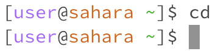
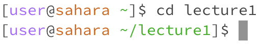
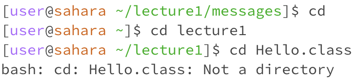
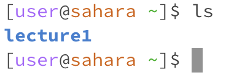
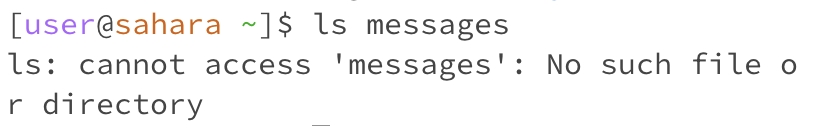
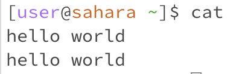
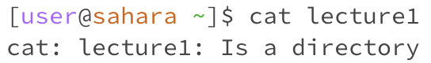
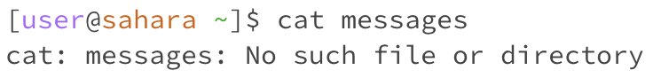
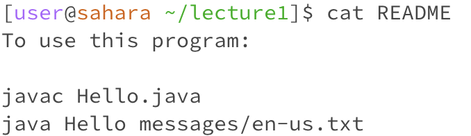

# Lab Report 01

## `cd`
### the command cd displays the name of the current directory or changes the current directory

> **using the command with no arguments**

- the working directory was /home
- There is no output because the command is internal, and so is parsed and executed completely by it's own process. Although there is no output given by the command itself, I can see that I am in my home directory in my next line. This is because when cd is executed without arguments, the user is returned to the home directory, and for my case I was already in the home directory so no visible change.
- The output (no output) is not an error

> **using the command with a path to a directory as an argument**

- the working directory was /home
- I got no output because as stated above, the command is internal and so is parsed and executed completely by it's own process. Yet although there is no output given by the command itself, I can see that I was moved to the directory of lecture1. This is because lecture1 was a directory in the filesystem of my home directory
- The output (no output) is not an error. 

- the working directory was /home/lecture1
- I got no output because as stated above, the command is internal and so is parsed and executed completely by it's own process. Yet although there is no output given by the command itself, I can see that I was moved to the file messages. This is because in the filesystem of lecture1 there existed a file called messages
- this output is not an error.

> **using the command with a path to a file as an argument**

- the working directory was /home/lecture1
- The output I got was a bash message that says that it cannot move to the Hello.class file because it is not a directory. In the filesystem there is a directory that goes to lecture1, and within this directory the file Hello.class is a class file, and so it cannot be navigated to. In the next line, the working directory is the same as before
- The output, a statement that Hello.class is not a directory, is an error because the code working would produce no output, as shown in the examples with the file as a directory, with the result would be a navigation to the new file.

## `ls`

> **using the command with no arguments**

> **using the command with a path to a directory as an argument**

> **using the command with a path to a file as an argument**

## `cat`

> **using the command with no arguments**

> **using the command with a path to a directory as an argument**

> **using the command with a path to a file as an argument**

