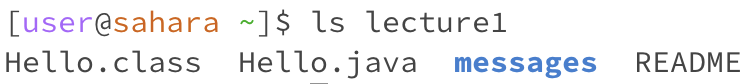
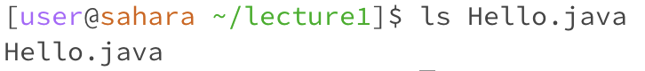

# Lab Report 01

## `cd`
### the command cd displays the name of the current directory or changes the current directory

> **using the command with no arguments**

- the working directory was /home
- There is no output because the command is internal, and so is parsed and executed completely by it's own process. Although there is no output given by the command itself, I can see that I am in my home directory in my next line. This is because when cd is executed without arguments, the user is returned to the home directory, and for my case I was already in the home directory so no visible change.
- The output (no output) is not an error

> **using the command with a path to a directory as an argument**

- the working directory was /home
- I got no output because as stated above, the command is internal and so is parsed and executed completely by it's own process. Yet although there is no output given by the command itself, I can see that I was moved to the directory of lecture1. This is because lecture1 was a directory in the filesystem of my home directory
- The output (no output) is not an error. 

- the working directory was /home/lecture1
- I got no output because as stated above, the command is internal and so is parsed and executed completely by it's own process. Yet although there is no output given by the command itself, I can see that I was moved to the file messages. This is because in the filesystem of lecture1 there existed a file called messages
- this output is not an error.

> **using the command with a path to a file as an argument**

- the working directory was /home/lecture1
- The output I got was a bash message that says that it cannot move to the Hello.class file because it is not a directory. In the filesystem there is a directory that goes to lecture1, and within this directory the file Hello.class is a class file, and so it cannot be navigated to. In the next line, the working directory is the same as before
- The output, a statement that Hello.class is not a directory, is an error because the code working would produce no output, as shown in the examples with the file as a directory, with the result would be a navigation to the new file.

## `ls`

> **using the command with no arguments**

- the working directory was /home
- The output I got was the lecture1, the only directory in the current working directory. To have no arguments when running the ls command, it will usually output the names of files and directories in the current directory, which in this case are the contents of the working director, /home
- This output is not an error. 

> **using the command with a path to a directory as an argument**

- the working directory was /home
- The output I got was Hello.class, Hello.java, messages (highlighted blue), and README. Because the argument in this case was lecture1, and the directory lecture1 was in the filesystem of the working directory, /home, the command listed the contents of the lecture1 directory.
- This output is not an error

- the working directory was /home
- The output I got was a message that ls cannot access 'messages' because there is no such file or directory. In the filesystem of /home, the only directory is lecture1.
- This output is an error because the command is not able to access the directory 'messages' because while it exists within /home, the command cannot access it because the working directory is /home, which doesn't have access to the directory 'messages'. This code would run as inticipated if the working directory was /home/lecture1, which has access to the directory 'messages'.

> **using the command with a path to a file as an argument**

- the working directory was /home/lecture1
- The output I got was Hello.java, the name of the file. Although the command 'ls' is typically used with an argument that is a directory, when it is used with an argument which type is a file, it typically provides information about that file. In this case, the output is the file's name.
- This output is not an error. 

## `cat`

> **using the command with no arguments**

- The working directory was /home
- The output I got was an interactive input where after typing text, in this case, 'hello world', the 'cat' command will display what I entered. Although this is not a very common usage, it is typically used for interactive input because by pressing 'Ctrl-D' or 'Ctrl-Z', you can see the input returned.
- This output is not an error.

> **using the command with a path to a directory as an argument**

- The working directory was /home
- The output I got was a error message that 'cat' recognizes the argument as a directory. In this case, lecture1 was in the filesystem of the home page.
- This is an error because a directory is not a valid operation for 'cat'. The 'cat' command is used to concatenate and display the content of files, not directories. If you want to list the contents of a directory, the 'ls' command should be used instead.

- The working directory was /home
- The output I got was an error message that 'cat' cannot find the file or directory 'messages'. In this case, 'messages' was not in the filesystem of the home.
- This is an error because the specified file or directory does not exist in the working directory. In this case, this is because the path to the directory 'messages' is incorrect. 

> **using the command with a path to a file as an argument**

- The working directory was /home/lecture1
- The output I got was the text of the README file, which was 'To use this program: javac Hello.java, java Hello messages/en-us.txt'. When the command 'cat' is ran with a file as its argument, it displays the contents of the specified file. The output is the content of the file printed to the terminal.
- This is not an error.

