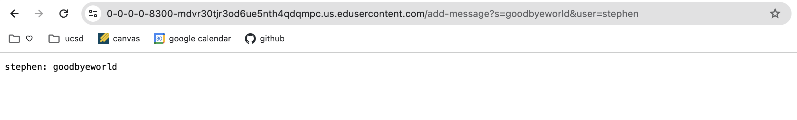
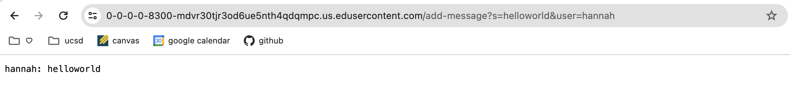
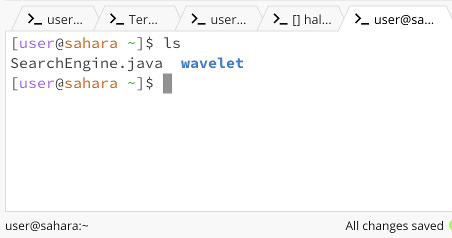
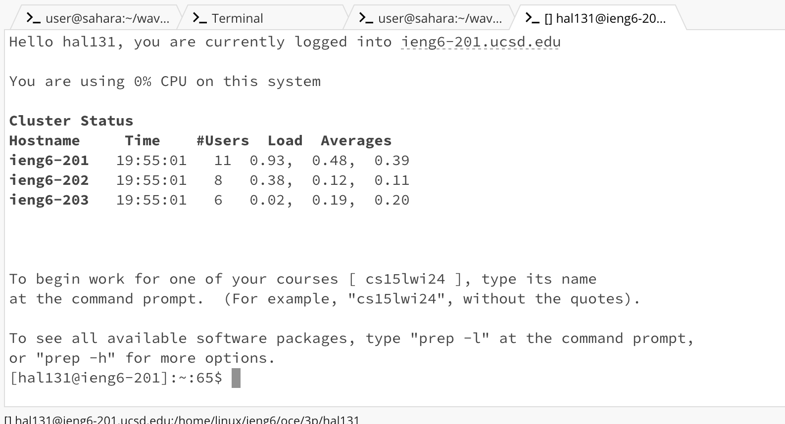
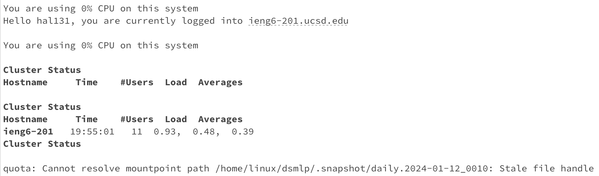

# Lab Report 02 - Servers and SSH Keys (Week 3)

## Part 01: ChatServer.java code

import java.io.IOException;
import java.net.URI;
import java.util.ArrayList;

class Handler implements URLHandler {
    String user = null;
    String chat_message = null;
    ArrayList <String> requests = new ArrayList<>();
    
    public String handleRequest(URI url) {
        if (url.getPath().equals("/")) {
            return displayHistory();
        } else if (url.getPath().equals("/add-message")) {
            return addMessage(url);
        } else {
            return "404 Not Found!";
        }
    }

    public String displayHistory() {
        StringBuilder chatHistory = new StringBuilder("\n");
        for (String request : requests) { 
            chatHistory.append(request).append("\n");
        }
        return chatHistory.toString();
    }

    public String addMessage(URI uri) {
        String[] parameters = uri.getQuery().split("&");
        for (String parameter : parameters) {
            String[] message = parameter.split("=");
            if (message.length == 2) {
                if (message[0].equals("s")) {
                    chat_message = message[1];
                } else if (message[0].equals("user")) {
                    user = message[1];
                }
            }
        }

        if (user != null && chat_message != null) {
            String chat = user + ": " + chat_message;
            requests.add(chat);
            return chat;
        } else {
            return "Invalid request format";
        }

    }

}

class ChatServer {
    public static void main(String[] args) throws IOException {
        if(args.length == 0){
            System.out.println("Missing port number! Try any number between 1024 to 49151");
            return;
        }

        int port = Integer.parseInt(args[0]);

        Server.start(port, new Handler());
    }
}

### Screenshot #1: message = helloworld & user = hannah

- the methods that were called in my code were handleRequest and addMessage
- the relevant argument for handleRequest was the url and the uri for addMessage. the values of the relevant fields of the class was the user, chat_message, and requests
- the value of user was changed to hannah, the chat_message to helloworld. 

### Screenshot #2: message = goodbyworld & user = stephen

- the methods that were called in my code were handleRequest and addMessage
- the relevant argument for handleRequest was the url and the uri for addMessage. the values of the relevant fields of the class was the user, chat_message, and requests
- the value of user was changed to stephen, the chat_message to goodbyeworld. 

## Part 02: using the command line

### Screenshot #3: absolute path to the private key for my SSH key for logging into ieng6

### Screenshot #4: absolute path to the public key for your SSH key for logging into ieng6

### Screenshot #5: terminal interaction where you log into your ieng6 account without being asked for a password.

