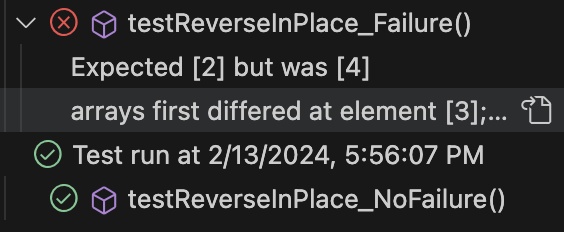
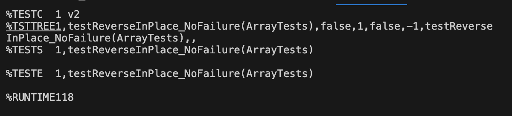
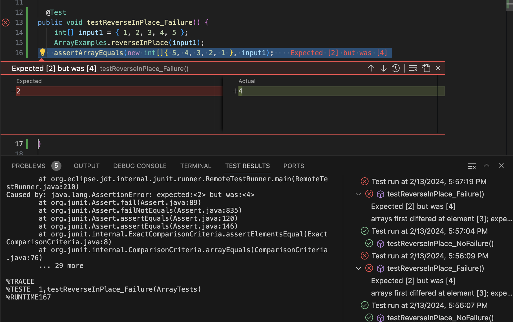

# Lab Report 03 | Bugs and Commands

## Part 1 | Bugs

### A failure-inducing input for the buggy program
```
@Test
public void testReverseInPlace_Failure() {
    int[] input1 = { 1, 2, 3, 4, 5 };
    ArrayExamples.reverseInPlace(input1);
    assertArrayEquals(new int[]{ 5, 4, 3, 2, 1 }, input1);
}
```
### An input that doesn't induce a failure
```
@Test 
	public void testReverseInPlace_NoFailure() {
    int[] input1 = { 5 };
    ArrayExamples.reverseInPlace(input1);
    assertArrayEquals(new int[]{ 5 }, input1);
	}
```

### The symptom, as the output of running the tests


- This output shows that the test for testReverseInPlace_NoFailure runs without a problem, which the test for testReverseInPlace_Failure failures. 


- This is the output when the test does not fail. This test means that the function returned 5 as expected. 


- This is the output when the test fails. This test means that the function returned returned 4 when it expected 2. 


### The bug, as the before-and-after code change required to fix it 

Before code change:
```
static void reverseInPlace(int[] arr) {
    for(int i = 0; i < arr.length; i += 1) {
      arr[i] = arr[arr.length - i - 1];
    }
  }
```

After code change:
```
static void reverseInPlace(int[] arr) {
    int n = arr.length;
    for (int i = 0; i < n / 2; i++) {
        int temp = arr[i];
        arr[i] = arr[n - i - 1];
        arr[n - i - 1] = temp;
    }
}
```

### Briefly describe why the fix addresses the issue.

This fix addresses the issue by traversing only half of the array and swapping the elements at the current index with the corresponding element from the end of the array. This ensures that the array is correctly reversed in place.

## Part 2 | Researching Commands

I focused on the command `grep`

### 1. 	`-r` which allows `grep` to recursively search through dictionaries for a specific pattern or string.

#### Example 1

