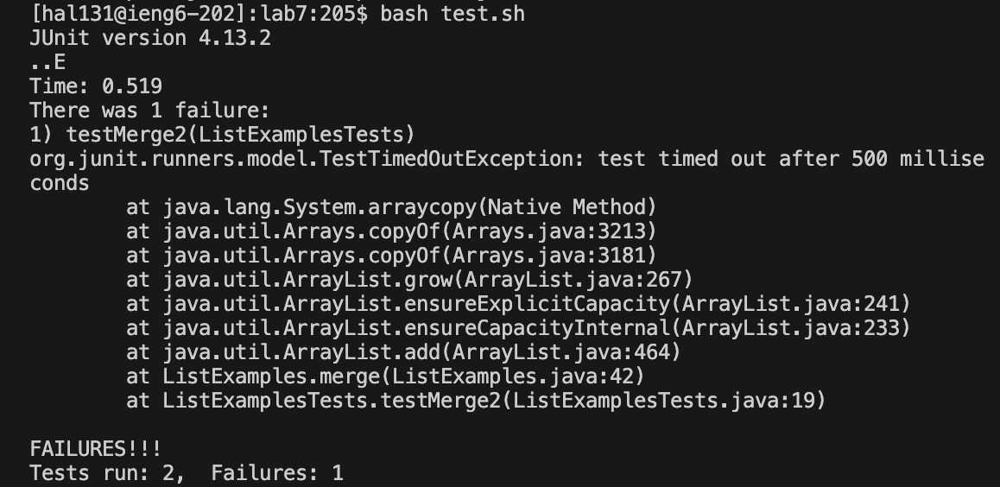
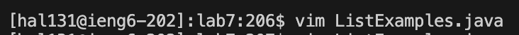
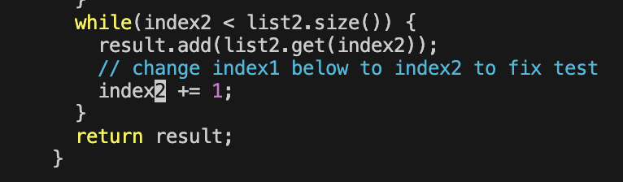
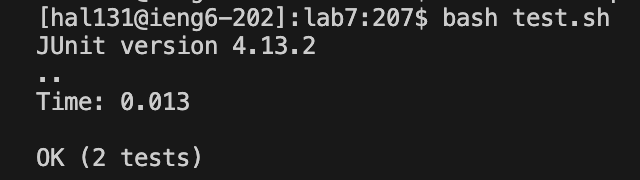

# Lab 04 | Vim (Week 07)

## Step 4: Log into ieng6

**Screenshot:**


**Keys pressed:**
For this step, I used the command ```ssh hal131@ieng6.ucsd.edu``` into the terminal. I set up to SSH without a password in previous steps so I didn't have to enter my password when logging in during the setup.

**Summary:**
I used the command ```ssh hal131@ieng6.ucsd.edu``` to log into my ieng6 account without using a password. 


## Step 5: Clone your fork of the repository from your Github account (using the SSH URL)

**Screenshots:**

This is a screenshot of my directory at the start, but just like in the instructions I delete any existing forks of the repository I have on my account (step 1 - Setup):


This is a screenshot of the SSH URL from github from my forked repository:


This is a screenshot of cloning the copied SSH URL from my forked repository into my ieng6 terminal:


**Keys pressed:**
- I ensured that I deleted any existing forks of the repository I have on my account using the command ```rm -rf lab7```
- The copied SSH URL from Github for my forked repository is: ```git@github.com:hannah1ee/lab7.git```
- I cloned the copied SSH URL into my ieng6 terminal using the commands and keys: ```git clone <CTRL+V> <Enter>```

**Summary:**
I first made sure to delete any existing forks of Lab7, then I used the SSH URL from Github for my forked repository to clone it into my ieng6 terminal.

## Step 6: Run the tests, demonstrating that they fail

**Screenshot:**

This is a screenshot of when I run the tests and determined that they failed:


**Keys pressed:**
- To ensured I switched into the correct directory ```lab7```, I used the command ```cd lab7 <Enter>```
- To run the tests, I ran the commands and pressed the keys: ```bash test<Tab> Enter```

**Summary:**
I first ensured I was switched into the correct directory, and then I ran the tests to demonstrate that they are failing.


## Step 7: Edit the code file to fix the failing test

**Screenshot:**

This is a screenshot of how I accessed the ```ListExamples.java``` file:


This is a screenshot of my fixed ```ListExamples.java``` file, where I modified ```index1``` to ```index2```:


**Keys pressed:**
- To edit the code file to fix the failing test, I accessed the ```ListExamples.java``` file using the command and keys: ```vim L<Tab>.java <Enter>```
- To search for the ```index1`` part of the code that I needed to edit, I used the keys: ```<n> <n> <n> <n> <n> <n> <n> <n> <n>```
- To edit ```index1``` to ```index2```, I used the key ```<e>``` to start at the end of the word, then the key ```<h>``` to move one step to the left to ensure that my cursor was hovering over the ```1``` of the ```index1```. Then I deleted the ```1``` using the key ```<x>``` and then changed it to ```<2>``` using the key ```<i>```. Finally, I exited the editing mode using the key ```<Esc>``` and saved my edits using the command ```:wq <Enter>``` 

**Summary:**
I  accessed the  ```ListExamples.java``` file using ```vim L<Tab>.java <Enter>``` then got to the right location using ```<n> <n> <n> <n> <n> <n> <n> <n> <n>```, ```<e>```, ```<h>```, and edited the file using ```<x>``` and ```<i>```. I exited and saved my file using ```<Esc>``` and ```:wq <Enter>```


## Step 8: Run the tests, demonstrating that they now succeed

**Screenshot:**

This is a screenshot of when I run the tests and determined that they passed:


**Keys pressed:**
- To run the tests, I ran the commands and pressed the keys: ```bash test<Tab> Enter```

**Summary:**
I ran the tests to demonstrate that they are failing.


## Step 9: Commit and push the resulting change to your Github account (you can pick any commit message!)

**Screenshot:**

**Keys pressed:**

**Summary:**


