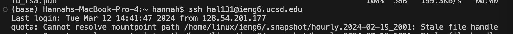
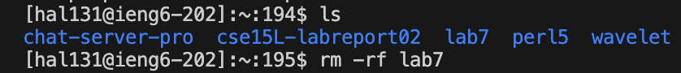
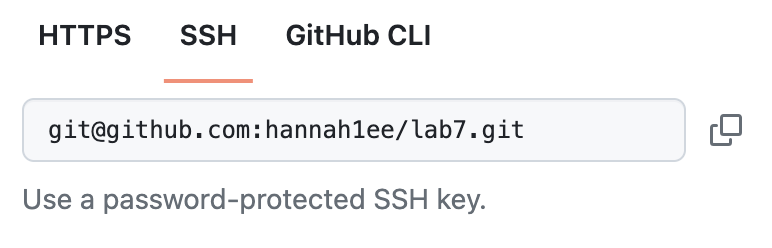
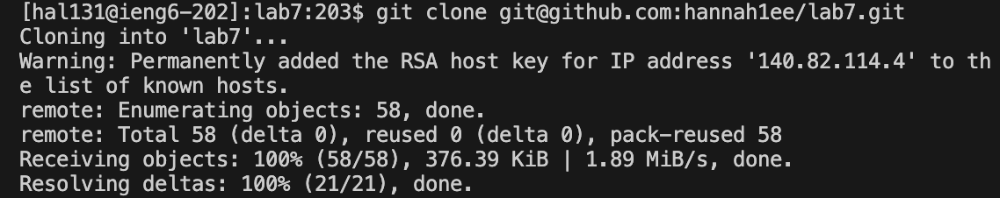

# Lab 04 | Vim (Week 07)

## Step 4: Log into ieng6

**Screenshot:**


**Keys pressed:**
For this step, I used the command ```ssh hal131@ieng6.ucsd.edu``` into the terminal. I set up to SSH without a password in previous steps so I didn't have to enter my password when logging in during the setup.

**Summary:**
I used the command ```ssh hal131@ieng6.ucsd.edu``` to log into my ieng6 account without using a password. 


## Step 5: Clone your fork of the repository from your Github account (using the SSH URL)

**Screenshots:**

This is a screenshot of my directory at the start, but just like in the instructions I delete any existing forks of the repository I have on my account (step 1 - Setup):


This is a screenshot of the SSH URL from github from my forked repository:


This is a screenshot of cloning the copied SSH URL from my forked repository into my ieng6 terminal:


**Keys pressed:**
- I ensured that I deleted any existing forks of the repository I have on my account using the command ```rm -rf lab7```
- The copied SSH URL from Github for my forked repository is: ```git@github.com:hannah1ee/lab7.git```
- I cloned the copied SSH URL into my ieng6 terminal using the commands and keys: ```git clone <CTRL+V> <Enter>```

**Summary:**
I first made sure to delete any existing forks of Lab7, then I used the SSH URL from Github for my forked repository to clone it into my ieng6 terminal.

## Step 6: Run the tests, demonstrating that they fail

**Screenshot:**

**Keys pressed:**

**Summary:**


## Step 7: Edit the code file to fix the failing test

**Screenshot:**

**Keys pressed:**

**Summary:**


## Step 8: Run the tests, demonstrating that they now succeed


## Step 9: Commit and push the resulting change to your Github account (you can pick any commit message!)


