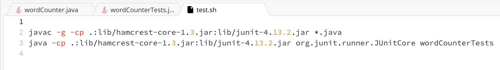

# Lab 05 | Putting it All Together (Week 09)

## Part 01 - Debugging Scenario

### Original Post From Student 

**EdStem Post:** Word Counter Program Not Working

Hi! I tried to implement the Java program ```WordCounter.java``` that's supposed to process a string and output how many words are in it. However, I'm encountering ann unexpected behavior when I run my program with certain strings. For some reason, the program doesn't run as expected when the input text contains characters other than spaces. I think the issue might be related to how I'm splitting the text into words.

Here is a screenshot showing the output of my test file when I try to run my program with strings containing characters other than strings: 


I've also attached my ```WordCounter.java``` file for reference:


Thank you for your help!

### Response from TA

Hi! You're on the right track using the ```split``` method, but the way tht you're using it might not handle the cases with multiple consecutive spaces or special characters like you've noticed. Can you try running your program with a debug print statement right after you split the texts to see how many words are in your array? That might help you understand how the ```split``` method is working. 

### Follow-up Post from Student

Thank you for your suggestion! I added the debug print statement as you recommended, and I realized that the way ```.length``` worked as well as splitting just with ```" "``` that it was not running the way I expected to. 

Here's a screenshot of the debug print statements I added to my ```WordCounter.java``` file:


And here's a screenshot of my initial terminal output when I ran my tests!


This made me realize that I should account for when the string is empty so that ```.length``` will work as I expect it to, and that I should account for other special characters than just space when splitting the words. The solution I came up with to be able to efficiently and accurately split the words was through using a regular expression that matches any non-word character or sequence of non-word characters. 

Here's a screenshot of my fixed ```WordCounter.java``` file, where I changed ```test.split(" ")``` to ```text.split("\\W+")``` as well as added the necessary conditions to handle empty string:


And heres the output as well as all my tests running! Thank you so much for guiding me in the right direction!


### All information needed about the Setup

> File & Directory Structure needed


> The contents of each file before fixing the bug





> The full command line (or lines) you ran to trigger the bug
- ```javac wordCounter.java```
- ```bash test.sh```

> A description of what to edit to fix the bug

To fix the issue where the split method only accounts for spaces, as well as doesn't correctly account for empty strings, you should change the split method to account for various other characters you might encounter in text using regex. This meant changing the split delimiter from a single space ```" "``` to a regex pattern that matches any non-word character, which could be spaces, punctuation marks, as well as otherr special characters. The regex pattern I used for this was ```"\\W+"```, where ```\\W``` matches any non-word character and ```+``` signals one or more occurances of the non-word character. I also accounted for empty strings as well as leading or trailing spaces by using ```.trim()``` which gets rid of those leading or training spaces and also added an ```in``` statement for when the string is empty to directly return 0. 

